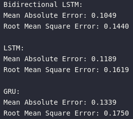

# Tide Level Forecasting using GRU, LSTM & Bidirectional LSTM

## Introduction 
The objective of the project was to create time series forecasting model to predict tide level of IDSL 307 Pangandaran.

## Method
GRU, LSTM & Bidirectional LSTM were used and evaluated, which one that have the best performance between the three.

## Results
### Metrics
